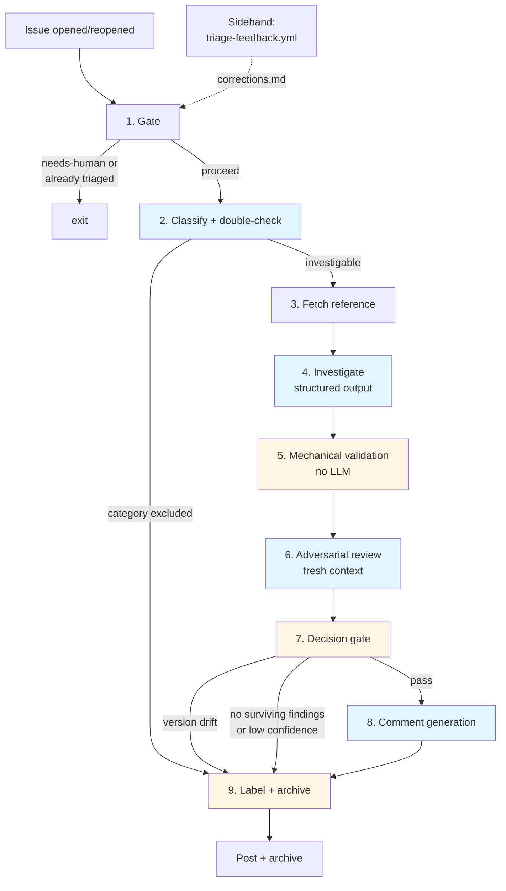

# Issue Triage Pipeline

Automated first-pass triage for GitHub issues on this repository. Runs on
`issues: [opened, reopened]` and on manual `workflow_dispatch`. Classifies the
issue, investigates likely root cause against the repo and the upstream
beautified source, validates every factual claim mechanically and with a
fresh-context LLM reviewer, and — when the validated findings clear hard
gates — posts an **explicitly non-authoritative draft comment** plus triage
labels.

The design is constrained by three simultaneous goals:

- **Useful**: give the maintainer a head start on orientation, candidate sites,
  and related issues.
- **Safe**: never mislead a reporter or reviewer with fabricated identifiers,
  non-matching patch code, or authoritative voice on unverified claims.
- **Cheap**: run in under three minutes per issue for a two-digit dollar
  monthly spend.

Everything in this document follows from those three goals being in tension.

---

## Design principles

> [!IMPORTANT]
> These seven principles are load-bearing. Every stage in the pipeline exists
> to serve one of them. If a future change breaks a principle, the stage it
> lives in should be removed, not weakened.

### 1. Mechanical checks before LLM checks

Grep, `gh api`, file stat, regex matching — deterministic, cheap, and
complementary to LLM reasoning. The class of error an LLM reviewer misses most
often is the one an LLM drafter made: fabricated identifiers, non-matching
anchors, misremembered issue numbers. A second LLM pass that only sees the
first pass's output can rubber-stamp the fabrication. A `grep -P` against the
actual source cannot.

LLM review is reserved for questions a grep cannot answer — semantic
entailment, intent, whether two issues describe the same failure mode.

### 2. Structured output, not prose

Every claim the pipeline produces has a typed slot: `file`, `line_start`,
`line_end`, `evidence_quote`, `claim_type`, `confidence`. Prose is generated
last, from already-validated structure. Free-form investigation output is
banned because it allows unverifiable assertions to hide inside narrative.

Anthropic's own Claude Code Security Review action uses structured tool output
for exactly this reason: it lets the pipeline drop individual findings without
rewriting prose around them.[^anthropic-security-review]

### 3. Writer/Reviewer with fresh context on source

The reviewer reads the **source** and the **claim**. It does *not* read the
drafter's reasoning or the draft comment. This is Anthropic's recommended
pattern for bias prevention in Claude Code[^anthropic-best-practices] — a
fresh context avoids the reviewer rationalizing the drafter's framing.

The reviewer is also **adversarial by construction**: it must produce the
strongest counter-reading of each evidence quote *before* emitting a verdict.
Rubber-stamping is the base rate for reviewer agents otherwise.

### 4. Category exclusion over classification

Whole classes of issue skip investigation entirely. Hardware-specific GPU
driver crashes, kernel-level behavior, non-reproducible reports, and
upstream-only bugs do not benefit from automated investigation against our
patch surface — the bot ends up inventing "launcher flag workarounds" for
problems outside our control.

This is the pattern Anthropic's security-review action uses to keep
signal-to-noise high: whole finding categories (DoS, open-redirects,
rate-limiting) are excluded upfront rather than triaged with
disclaimers.[^anthropic-security-review]

### 5. Confidence gates suppress, not hedge

Low-confidence findings do not get posted with a cautionary footer. They do
not get posted. Labels apply; comment is skipped. Research consistently shows
that posting hedged but confident-looking output is worse than posting
nothing — specificity reads as authority regardless of preamble
phrasing.[^diffray-hallucinations][^lakera-hallucinations]

### 6. Non-authoritative framing is structural, not textual

The comment template signals tentativeness through structure:

- Upfront "won't-do" boundary statement (what the bot *will not* claim),
  modeled on Anthropic's "won't approve PRs — that's still a human
  call"[^anthropic-code-review]
- Required file:line citations on every claim (enforced by post-processor —
  claims without citations are dropped)
- Hypothesis phrasing ("Looks like X", "Likely path is Y") — prompt-enforced
  and post-processor-checked
- Patch code in a collapsed `<details>` block, labeled as unverified draft
- No voice replication of the maintainer

A disclaimer sentence alone cannot neutralize the amplifying effect of
authoritative voice; the shape of the artifact has to do the work.

### 7. Feedback is an explicit signal, not a pattern-matched one

Keyword-triggered "bot got this wrong" capture is theater — corrections arrive
as natural language, curation never happens, the file grows stale. Real
feedback uses explicit signals the pipeline can act on deterministically:

- 👎 reaction on a bot comment auto-opens a correction issue
- `/triage-wrong` slash command in any reply opens the same
- A human-curated `.claude/triage-corrections.md` file is loaded as context
  into future runs

No free-form NLP classification of collaborator replies.

---

## Pipeline overview



Stages shaded blue are LLM calls; amber are deterministic bash steps.

| Stage | Runtime | Tool | Purpose |
|-------|---------|------|---------|
| 1. Gate | ~5s | bash | Skip already-triaged, load corrections file |
| 2. Classify | ~30s | Sonnet (×2) | Categorize + double-check exclusions |
| 3. Fetch reference | ~10s | bash | Download `reference-source.tar.gz` |
| 4. Investigate | ~90s | Sonnet | Structured findings + sweeps + anchors |
| 5. Mechanical validation | ~15s | bash | Grep, `gh`, closed-world extraction |
| 6. Adversarial review | ~40s | Sonnet | Counter-reading + verdict, fresh context |
| 7. Decision gate | ~1s | bash | Enforce hard gates |
| 8. Comment generation | ~40s | Sonnet | Template-enforced draft |
| 9. Label + archive | ~5s | bash | Apply labels, post, upload artifacts |

Total: ~3 minutes per investigable issue. Excluded-category issues exit at
~35s (stages 1–2 plus archive).

---

## Stage-by-stage detail

### 1. Gate

Deterministic filter. Runs before any paid API call.

**Skip conditions:**

- Issue labeled `triage: needs-human` (unless manually dispatched)
- Issue already has a terminal triage label (`investigated`, `duplicate`,
  `not-actionable`)
- Title similarity >0.9 with an open issue (likely duplicate, defers to
  human)

**Side effects:**

- Loads `.claude/triage-corrections.md` as context for downstream stages.
  This file contains human-curated past errors, classified by failure class
  (identifier-hallucination, false-duplicate, missed-site, version-drift,
  etc.). Future runs see them and are instructed to avoid the same shapes.

### 2. Classify

First Sonnet call. Structured JSON output only.

<details>
<summary><b>Classify output schema</b></summary>

```json
{
  "classification": "bug|feature|question|duplicate|needs-info|not-actionable|needs-human",
  "confidence": "high|medium|low",
  "claimed_version": "1.3109.0 | null",
  "category": "bug|feature|question|driver|hardware|kernel|upstream-only|container|...",
  "exclusion_reason": "null | string — filled iff category excluded",
  "category_evidence": "verbatim excerpt from the issue body supporting the category",
  "suggested_labels": ["priority: high", "format: rpm", ...],
  "duplicate_of": "null | integer"
}
```

</details>

The `claimed_version` field is parsed from the issue body — `--doctor`
output, `claude-desktop (X.Y.Z)` references, AppImage filenames. Consumed
by stage 7 to gate against version drift.

> [!WARNING]
> **Category exclusion is verified by a second Sonnet pass.** If the first
> pass flags the issue as excluded, a second call sees only the issue body,
> the `category_evidence` excerpt, and the exclusion list — no other context.
> Only if both agree does the exclusion apply. Classify is the least-validated
> stage elsewhere in the pipeline; this double-check is how we budget for its
> miscalibration.

**Excluded categories** route to stage 9 with a `triage: needs-human` label
and no comment. Current exclusions:

- `driver` (NVIDIA, AMD, Intel GPU driver issues)
- `hardware` (specific-chipset crashes, sensor/thermal issues)
- `kernel` (namespace restrictions, cgroup behavior, distro kernel
  differences)
- `upstream-only` (reproduces on unmodified Claude Desktop on Windows/macOS)
- `container` (Distrobox/Flatpak/Docker without display passthrough)

### 3. Fetch reference

Downloads `reference-source.tar.gz` from the GitHub release matching
`CLAUDE_DESKTOP_VERSION`. This tarball is produced by `ci.yml` on every
release: `app.asar` extracted, `.vite/build/*.js` beautified with Prettier,
tarred. No re-extraction happens in the triage pipeline — that work was
already done once at release time.

If `claimed_version` from stage 2 differs from `CLAUDE_DESKTOP_VERSION`,
`VERSION_DRIFT=true` is exported and consumed by the stage 7 gate. The
reference still downloads, investigation still runs (the artifacts are useful
internally), but stage 7 will prevent a public comment.

### 4. Investigate

Sonnet call with repo + reference source + corrections file + issue
context. **Output is schema-enforced — no free prose permitted.**

<details>
<summary><b>Investigation output schema</b></summary>

```json
{
  "findings": [
    {
      "claim_type": "identifier|behavior|flow|absence",
      "claim": "string — the factual assertion being made",
      "file": "path/to/file.js",
      "line_start": 1234,
      "line_end": 1240,
      "evidence_quote": "verbatim source excerpt supporting the claim",
      "confidence": "high|medium|low",
      "enclosing_construct": "for identifier claims only — the enum/switch/literal containing the identifier"
    }
  ],
  "pattern_sweep": [
    {
      "pattern": "regex pattern used to sweep the repo",
      "match_count": 17,
      "matches": [
        { "file": "...", "line": 42, "snippet": "..." }
      ]
    }
  ],
  "proposed_anchors": [
    {
      "description": "what this regex targets",
      "regex": "pattern",
      "expected_match_count": 1,
      "target_file": "path/to/file",
      "word_boundary_required": true
    }
  ],
  "related_issues": [
    {
      "number": 288,
      "why_related": "one-sentence rationale",
      "quoted_excerpt": "relevant snippet from the cited issue"
    }
  ]
}
```

</details>

**Hard schema bans** (validator rejects output if any present):

| Banned | Why |
|--------|-----|
| Negative per-site assertions ("X should stay as-is") | Bad historical track record; these block fixes instead of enabling them |
| "Already fixed in #N" without a diff/PR link | Same failure class — an unverified negative claim that blocks scope |
| Substring regex on identifier claims | Substring matches pass `grep` but don't prove identifier identity |
| `expected_match_count: ">=1"` | Must be exact — ≥1 is what lets fabricated anchors slip through |
| Prescriptive patch text without a backing finding | Detached prescriptions are how unverified `sed` patterns get posted |

**Pattern-sweep caps:** each sweep is limited to 20 match rows. Additional
matches are summarized as `match_count: N (showing first 20)`. This prevents
investigation token bloat on common identifiers.

### 5. Mechanical validation

Pure bash. No LLM call. Produces `validation.json` with pass/fail per item.

**Per finding:**

- [x] `file` exists and `line_end` is within the file's length
- [x] `evidence_quote` grep-matches at the cited `file:line_start`
- [x] If `claim_type == "identifier"`, extract `closed_world_options` — the
  full enclosing enum/switch/case-block/object-literal — verbatim, using
  `ast-grep` (fast, language-aware). The options list is attached to the
  finding for the reviewer to use in stage 6.

**Per proposed anchor:**

- [x] `grep -P` against the reference source with `\b` word boundaries
  enforced for identifier anchors
- [x] Match count **exactly equal** to `expected_match_count` (not ≥)
- [x] No substring hits on identifier-type anchors

**Per related_issue:**

- [x] `gh issue view NNN` — actual title, state, first 500 chars of body
  captured and attached to the finding. The bot's `why_related` claim is
  not trusted — the reviewer in stage 6 reads the real body.

**Per pattern_sweep match:**

- [x] Re-grep to confirm the match still exists (catches investigation
  hallucinating file paths or line numbers)

> [!NOTE]
> **Why the closed-world extraction matters.** A bot that fabricates an
> identifier (e.g., claiming the VM backend values are `qemu`/`virt` when
> they're actually `kvm`/`bwrap`/`host`) can pick a nearby real line
> containing the substring "virt" as its `evidence_quote`. Grep validation
> alone would pass this — the quote exists, the file exists, the line
> matches. Closed-world extraction pulls the full enum the claim is *about*
> and hands it to the reviewer as a bounded option list. "Is the claimed
> identifier in this list?" is a closed question the reviewer cannot
> rationalize around.

### 6. Adversarial review

Sonnet call with **fresh context**. Does NOT see the draft comment, the
investigation's free-form reasoning, or any voice instructions. Sees only:

- The original issue
- `validation.json` with findings that passed mechanical
- `closed_world_options` for each identifier-type finding
- The actual fetched body of each cited related issue
- Source excerpts at claim sites

**Prompt is adversarial per finding, in this order:**

1. State the strongest counter-reading of this evidence quote. What would
   make this claim wrong, given the actual code shown?
2. For identifier claims: list every option in `closed_world_options`. Is
   the claimed identifier verbatim in that list? (yes/no — exact match only)
3. For related_issues: does the fetched body describe the same failure mode?
   (exact / related / unrelated)
4. **Only after steps 1–3**, give a verdict on each finding. No new claims.

Output is per-item verdicts. The reviewer cannot propose new findings,
cannot rewrite the drafter's claims, and cannot insert prose. Its only
powers are: approve, reject, or downgrade confidence.

> [!WARNING]
> **Reviewer approval rate is a health metric.** Rolling approval rate is
> logged to telemetry. If it exceeds **70%**, a GitHub issue is auto-opened
> warning the reviewer is rubber-stamping — the prompt needs re-tuning, or
> the drafter is producing findings too weak for the reviewer to
> meaningfully discriminate. See [Health monitoring](#health-monitoring).

### 7. Decision gate

Deterministic. Evaluates all hard gates; any failure routes to
"labels-only, no post."

| Gate | Trigger | Action |
|------|---------|--------|
| Version drift | `claimed_version != CLAUDE_DESKTOP_VERSION` | Labels only |
| No surviving findings | Zero items passed mechanical + review | `triage: needs-human`, labels only |
| Low average confidence | Avg confidence of survivors < medium | `triage: needs-human`, labels only |
| Excluded category | Already caught at stage 2, defensive check | Labels only |

All gates are fail-closed. If any condition is ambiguous, the gate denies
the comment.

### 8. Comment generation

Sonnet call with only the findings that survived every prior stage. Prompt
mandates hypothesis framing ("Looks like", "Likely", "Worth checking first")
and requires a file:line citation on every factual claim.

**Template structure, enforced by post-processor:**

```markdown
**Automated draft — AI analysis, not maintainer judgment.** This bot won't
close issues, apply labels beyond triage routing, or claim fixes are
shipped. Findings below are starting points; the code citations are what
to verify first.

[one hypothesis line]

- [finding with required `file:line` citation]
- [finding with required `file:line` citation]

<details>
<summary>Unverified patch sketch (draft, not applied)</summary>

[patch code here, if any — runs only if confidence high AND proposed_anchor
verified match-count exactly 1]

</details>

Related: #NNN — exact-match | related | unrelated (per reviewer rating)

---
React 👎 on this comment if a finding is wrong, or run `/triage-wrong` in
a reply to open a correction issue.
```

**Post-processor enforcement:**

- [x] Drop any claim sentence without a `file:line` or `#NNN` citation
- [x] Strip LLM preambles — regex removal of lines like
  `^(Here'?s|I'?ve got|I have everything|Sure|Certainly|Got it|OK)`
- [x] Enforce 400-word cap (truncate the `<details>` patch section if
  needed, never the findings)
- [x] Refuse to post if the enforced template leaves less than two
  findings standing

### 9. Label + post + archive

Deterministic. Always applies triage labels (classification maps to
`triage: investigated` | `duplicate` | `needs-info` | `not-actionable` |
`needs-human`). Always applies `suggested_labels`.

Posts the comment only if stage 7 passed and the template enforcer produced
non-empty output.

Uploads three artifacts (14-day retention):

- `investigation.json` — raw investigation output
- `validation.json` — per-item mechanical + review verdicts
- `review.json` — counter-readings and closed-world answers

Writes a structured summary to `$GITHUB_STEP_SUMMARY`:

| Metric | Value |
|--------|-------|
| Classification | bug |
| Confidence | medium |
| Category | bug (investigable) |
| Findings proposed | 4 |
| Findings passed mechanical | 3 |
| Findings passed review | 2 |
| Comment posted | yes |

---

## Feedback loop

Separate workflow: `.github/workflows/triage-feedback.yml`.

### Trigger A — slash command

`issue_comment` event. If the comment body contains `/triage-wrong`, parse
the surrounding context (bot comment being replied to, the correction text)
and open a correction issue labeled `triage-correction`. Assign to
`@aaddrick`. Link back to both the bot comment and the source issue.

### Trigger B — reaction

`reaction` event for 👎 on a comment by `github-actions[bot]` in the triage
flow. Fetch the bot comment plus the issue body, open a correction issue
with both, assign to `@aaddrick`.

### Trigger C — human curation

Maintainer consolidates correction issues into
`.claude/triage-corrections.md`. Entries are classified by failure class:

```markdown
## Identifier hallucination — issue #442 (2026-04-19)
Bot invented `qemu` / `virt` as VM backend values. Actual values are
`kvm` / `bwrap` / `host` — see `scripts/cowork-vm-service.js:2226-2232`.
Closed-world extraction should have caught this; reviewer approved
because `evidence_quote` was from a nearby real line.

## False duplicate — issue #382 (2026-04-12)
Bot asserted fix landed in #373; it had not. Negative assertions about
issue state need diff/PR link citations.
```

This file is loaded as context by every subsequent triage run (stage 1).
The drafter and reviewer prompts instruct: "Before making a claim, check
whether a similar claim appears in the corrections file. If so, be
especially strict about evidence."

---

## Health monitoring

Telemetry emitted per run, aggregated on a rolling window:

| Metric | Alert threshold |
|--------|----------------|
| Classify confidence distribution | — (logged, not alerted) |
| Mechanical validation pass rate | > 95% rolling → validation too lax |
| Reviewer approval rate | > 70% rolling → reviewer is rubber-stamping |
| Version drift rate | > 30% → fetch-reference needs stronger pinning |
| Exclusion rate | (monitored for classify-miscalibration) |
| Comment-post rate vs. labels-only rate | (expected ~60/40; skew signals gate miscalibration) |
| Time-to-correction (bot comment → 👎) | (low = high error rate) |

Alerts open GitHub issues in the repo labeled `triage-health`.

---

## What is explicitly out of scope

- **Voice replication.** The bot speaks as bot. No prior-art fetching of
  writing-style profiles. The disclaimer banner does not try to mimic the
  maintainer.
- **Closing issues, merging patches, assigning priority beyond label
  routing.** The bot's label scope is `triage: *` and `suggested_labels`
  from the classification schema. Priority, assignee, and milestone changes
  are manual.
- **Speculative fixes for out-of-scope categories.** Driver/hardware/kernel
  issues route to `needs-human` without investigation; no launcher-flag
  workarounds get prescribed.
- **Posting hedged low-confidence output.** If the confidence or validation
  gates fail, the comment is not posted. Labels are still applied.

---

## References

### Anthropic — agent design and review patterns

[^anthropic-framework]: [Our framework for developing safe and trustworthy
  agents](https://www.anthropic.com/news/our-framework-for-developing-safe-and-trustworthy-agents).
  Five principles for agent design; emphasizes process transparency and
  human-in-the-loop over output-level disclaimers.

[^anthropic-code-review]: [Code Review for Claude
  Code](https://claude.com/blog/code-review). Source of the "won't approve
  PRs — that's still a human call" framing pattern. Documents the
  Writer/Reviewer pattern and confidence-based surface gating.

[^anthropic-security-review]: [claude-code-security-review (GitHub
  Action)](https://github.com/anthropics/claude-code-security-review).
  Anthropic's own automated review bot for PRs. Source of
  category-exclusion and upfront limitation-disclosure patterns.

[^anthropic-best-practices]: [Best Practices for Claude
  Code](https://code.claude.com/docs/en/best-practices). Documents the
  fresh-context Writer/Reviewer pattern and confidence-scoring multi-agent
  review.

[^anthropic-autonomy]: [Measuring AI agent autonomy in
  practice](https://www.anthropic.com/research/measuring-agent-autonomy).
  User trust is earned and measurable (~20% auto-approve for novices
  rising to ~40% with experience). Motivates the conservative-framing
  choice: trust-erosion from wrong output is slow to recover.

### LLM hallucination research

[^diffray-hallucinations]: [LLM Hallucinations in AI Code Review
  (diffray)](https://diffray.ai/blog/llm-hallucinations-code-review/).
  29–45% of AI-generated code contains security vulnerabilities; ~20% of
  package recommendations reference non-existent libraries. Motivates the
  "validate proposed patches against actual source" gate.

[^lakera-hallucinations]: [LLM Hallucinations in 2026: How to Understand
  and Tackle AI's Most Persistent
  Quirk](https://www.lakera.ai/blog/guide-to-hallucinations-in-large-language-models).
  Hallucinations originate from training incentives where confident
  guessing outperforms acknowledging uncertainty. Motivates
  structural-tentativeness framing over prose hedges.

### GitHub — automated triage in production

[^github-taskflow]: [AI-supported vulnerability triage with the GitHub
  Security Lab Taskflow
  Agent](https://github.blog/security/ai-supported-vulnerability-triage-with-the-github-security-lab-taskflow-agent/).
  Production LLM-triage system. Source of the "require precise file and
  line references" and "staged verification with intermediate artifacts"
  patterns.

[^github-copilot-review]: [Responsible use of GitHub Copilot code
  review](https://docs.github.com/en/copilot/responsible-use/code-review).
  Documents the structural-tentativeness approach (suggestions require
  manual approval rather than explicit uncertainty signals) and the
  "missed issues / false positives / unreliable suggestions" disclosure
  triad.

### Other

[^triage-project]: [trIAge — LLM-powered triage bot for open
  source](https://github.com/trIAgelab/trIAge). Reference implementation of
  an open-source triage bot; useful as a comparative architecture.
